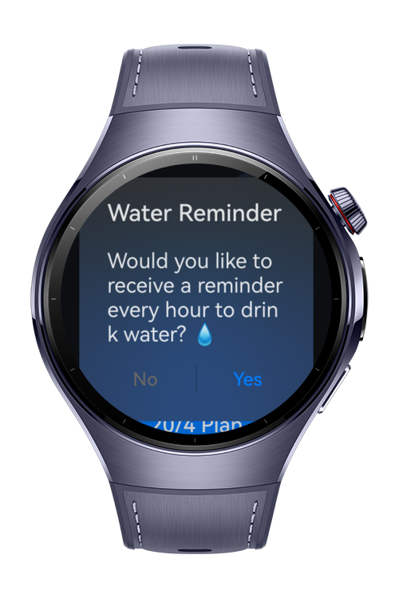
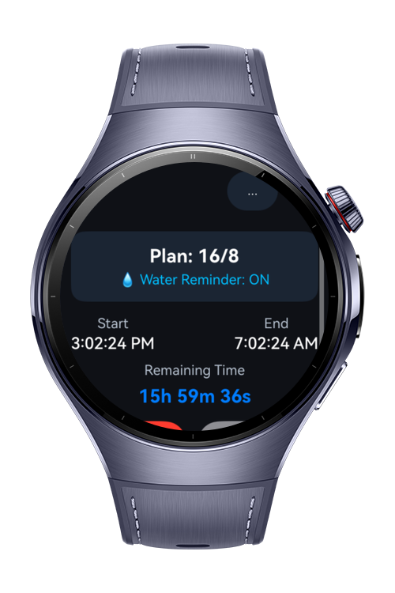
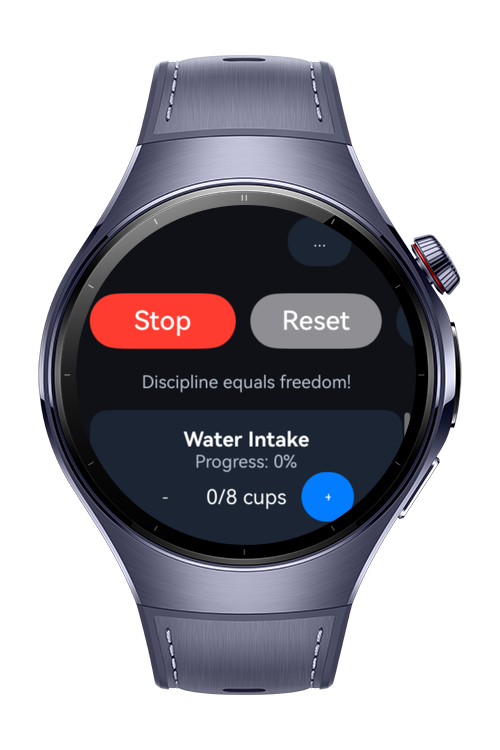

> **Note:** To access all shared projects, get information about environment setup, and view other guides, please visit [Explore-In-HMOS-Wearable Index](https://github.com/Explore-In-HMOS-Wearable/hmos-index).

# Fasting App

**Fasting App** is a HarmonyOS fasting application. Allows the user to select intermittent fasting plans (16/8, 18/6, 20/4), track remaining time, record water consumption, receive notifications, and view statistics.

# Preview
<div>

   

</div>

# Use Cases
- Select a fasting plan (16/8, 18/6, 20/4)
- Start, pause, stop, or reset fasting sessions
- View remaining fasting time with live updates
- Receive notifications
- Track daily water intake & set water goal
- Access statistics: total completed fasts & total fasting hours
- Switch between dark mode / light mode


# Technology

## Stack
- **Languages:** ArkTS (TypeScript)
- **UI:** ArkUI (`@kit.ArkUI`)
- **Tools/IDE:** DevEco Studio **6.0.0**
- **SDK:** HarmonyOS SDK **5.1.0.54**
- **Libraries:** Built-in kits only

# Directory Structure
```
entry/
└── src/
    └── main/
        └── ets/
            └── pages/
                └── Index.ets
```

# Constraints and Restrictions

## Supported Device
- Huawei Watch 5

## App Limits
- On-device processing (no backend)
- Foreground workout tracking
- Optimized for wearables

# License
**Fasting App** is distributed under the terms of the MIT License  
See the [LICENSE](./LICENSE) for more information.
